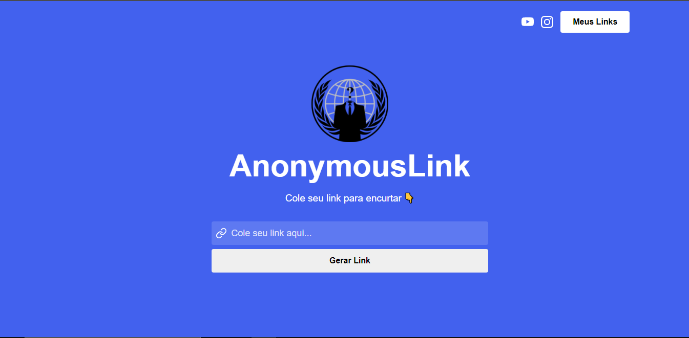

<h1 align="center">
    Encurtador de Links
</h1>

## 📃 Sobre

Encurtador de Links utilizando a biblioteca ReactJS com axios para fazer requisição HTTP. A aplicação consiste em criar um novo link mais enxuto baseado no que foi digitado pelo usuário no campo de texto.

---

## 🚀 Tecnologias utilizadas

O projeto foi desenvolvido com as seguintes tecnologias:

- ReactJS
- Axios
- API do bit.ly

---

## 📷 Imagens

<h1 align="center">
    
</h1>

## 📁 Como baixar o projeto

```bash

    # Clonar o repositório
    $ git clone https://github.com/EnzoXavier1001/encurtador-links

    # Entrar no diretório
    $ cd meulink

    # Baixar dependências
    $ yarn install

    # Executar o comando
    $ npm start

```